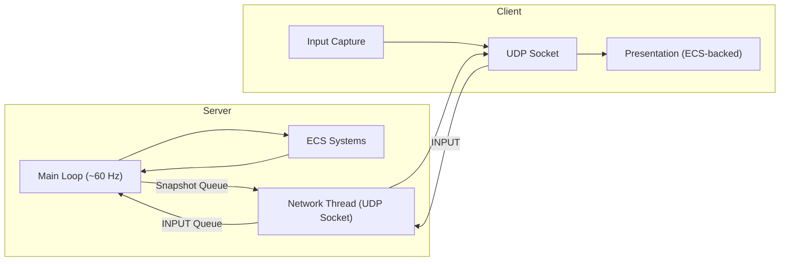
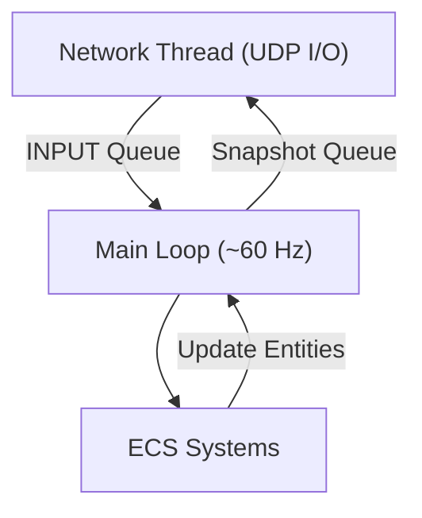

# Architecture Overview

This document describes the runtime architecture of the project in a language- and library-agnostic way. It reflects the current implementation: a server-authoritative model over UDP, ECS-based game logic, and asynchronous networking using threads.

## High-level System View



- Server: The authoritative source of truth. Processes inputs asynchronously via a network thread, advances the world each tick, spawns entities, resolves collisions/damage, and broadcasts snapshots/events via a snapshot queue.
- Client: Captures user input, sends INPUT messages, consumes SNAPSHOT/EVENT updates, and renders. Local ECS presentation systems run for responsiveness; server snapshots overwrite state for authority.

---

## Server Threading Model



- Network thread handles all UDP send/receive asynchronously.
- Main loop thread consumes INPUT packets from queue, updates ECS, and pushes snapshots/events to network queue.
- Queues are thread-safe (mutexes or lock-free).
- Main loop remains deterministic and non-blocking.

---

## Server Runtime Model

The server runs a deterministic main loop at ~60 Hz and uses a separate network thread for UDP I/O.

Pseudocode overview:

```
initialize();
wait_for_players();

start_thread(network_thread, [&]{
    while (running) {
        pkt = udp_socket.try_receive();
        if (pkt) input_queue.push(pkt);
        snapshot = snapshot_queue.pop();
        if (snapshot) udp_socket.send(snapshot);
    }
});

tick_dt = 16 ms
last_tick = now();

while (running) {
    // Process all available INPUT packets
    while (input_queue.has_items()) {
        pkt = input_queue.pop();
        process_network_input(pkt);
    }

    // Fixed-step simulation (~60 Hz)
    if (now() - last_tick >= tick_dt) {
        game_logic_tick();    // ECS: movement, collisions, AI, damage, spawns
        snapshot = build_snapshot();
        snapshot_queue.push(snapshot);
        tick++;
        last_tick += tick_dt;
        if (now() - last_tick >= tick_dt) last_tick = now();
    }
}
```

Notes:
- Network I/O never blocks the main loop.
- Queues decouple network and ECS threads.
- Snapshots are capped to respect MTU (~1500 bytes).

---

## Client Runtime Model

Each frame:
1. Capture input (pressed/released keys)
2. Send INPUT message to server
3. Consume all available network packets (SNAPSHOT/EVENT/LEVEL_START/LEVEL_END)
4. Run local ECS presentation systems:
   - control_system, position_system, scroll_reset_system, animation_system
5. Apply latest authoritative snapshot (overwrite state)
6. Render frame

Ensures responsive gameplay while maintaining server authority.

---

## Networking Model (summary)

- Transport: UDP, binary protocol with fixed 8-byte header
- Direction: Client→Server INPUT, Server→Client SNAPSHOT/EVENT
- Queued architecture decouples networking from ECS
- Authority: Server is authoritative; clients do not simulate ownership
- Reliability: Critical handshake retries; no per-packet ACK

---

## Game Logic and ECS

Server-side ECS Systems:
- Movement / integration (fixed timestep)
- Projectile updates & lifetime management
- Collision & damage with cooldown
- AI behaviors & spawn logic
- Snapshot building for network

Client-side ECS Systems (presentation):
- Control & velocity reset
- Position integration
- Decor/background scrolling
- Animation & rendering per layer

---

## Layers

1. Presentation layer — draws sprites/UI; no game rules
2. Networking layer — async UDP send/receive; parses/serializes messages
3. Game logic layer — ECS, deterministic tick updates
4. Input layer (client) — captures user inputs, generates INPUT messages

---

## Performance & Limits

- Server tick rate: ~60 Hz
- Snapshots capped to MTU (~1500 bytes)
- Non-blocking UDP ensures responsiveness under packet loss

---

## Fault Tolerance

- Main loop continues regardless of client delays or crashes
- Unknown/malformed packets ignored
- Clients reconstruct state from latest authoritative snapshot
