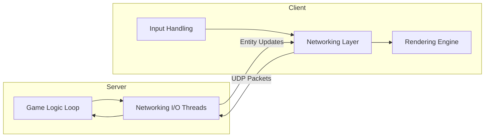
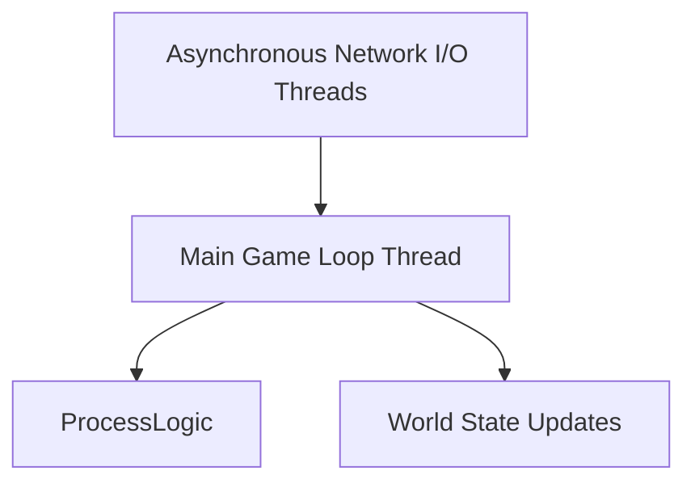

# Architecture Overview

## High-level System View

- **Server:** The **authoritative** state of the game. Handles world updates each tick, manages inputs, spawns, collisions, deaths.
- **Client:** Lightweight renderer + input capture. Displays world as dictated by the server.

---

## Server Threading Model

- The server must continue its loop regardless of client delays/crashes.
- Networking I/O is asynchronous (non-blocking).

---

## Game Engine Layers

1. **Rendering Layer** – SFML/SDL/Raylib handles drawing only.
2. **Networking Layer** – Handles UDP packets, encapsulated in `Packet` abstractions.
3. **Game Logic Layer** – ECS pattern recommended. Entities defined as IDs, augmented with Components (Position, Velocity, Sprite, HP…).
4. **Input Layer (Client only)** – Encapsulates keyboard/mouse/gamepad.

---

## Entity-Component-System (ECS) Idea

- **Entity:** An integer ID.
- **Component:** Data only (position, velocity, sprite, HP…).
- **System:** Pure logic to update components each frame (e.g., `MovementSystem`, `CollisionSystem`).